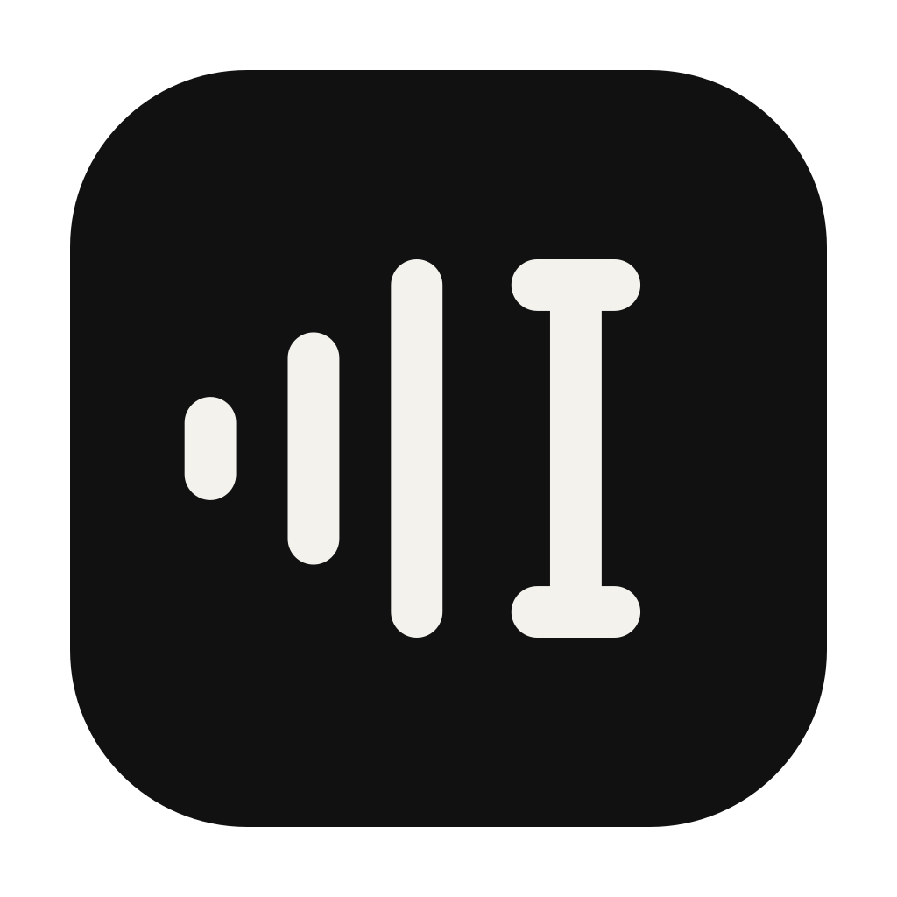

<p align="center">
  
</p>

<h1 align="center">NeverType</h1>

<p align="center">
  Ditado por voz local no macOS.<br>
  <sub>Áudio, modelo e transcrição ficam no seu Mac.</sub>
</p>

<p align="center"><a href="README.md">English</a></p>

Segure uma tecla em qualquer aplicativo, fale, solte, e o texto aparece onde o
cursor está.

Cerca de 600 ms por ditado com o modelo quente, num MacBook Pro M4 Pro.

## O que faz

Segure o **⌘ direito**, fale, solte. A transcrição é colada no cursor. Dois
toques rápidos travam a gravação para você falar com a tecla solta, mais um
toque encerra e Esc descarta. O overlay permanece um círculo de 34 px com a
marca do NeverType. Os três traços se movem com a voz, inclusive em mãos-livres,
e viram pontos móveis ao lado do mesmo cursor enquanto o texto é escrito.

O menu da barra oferece ⌘, ⌥ e ⌃ direitos como escolhas rápidas, e **Other key
or mouse button…** deixa você apertar a tecla que quiser: um modificador dos
dois lados, Fn ou um botão do mouse a partir do terceiro. O que não pode ser a
tecla é recusado na hora, com o motivo na tela, ⇧ e ⌘ esquerdo entre eles. Uma
segunda tecla trava o mãos-livres com um toque. O menu também guarda as últimas
30 transcrições e um vocabulário customizado. Um clique no círculo abre esse
mesmo menu, que é como se chega nele em tela cheia. O
[`docs/reference.md`](docs/reference.md) passa por cada item, inclusive a tabela
de teclas aceitas e recusadas.

## Requisitos

- macOS 14 ou mais novo em Apple Silicon. A inferência roda na GPU pelo Metal.
  Na CPU a mesma inferência fica cerca de 11× mais lenta
  ([`docs/pitfalls.md`](docs/pitfalls.md)), o que inviabiliza o ditado.
- Command Line Tools do Xcode, que trazem a toolchain do Swift 6 que o build
  usa. Xcode completo é opcional.
- `cmake`, para compilar (`brew install cmake`).
- O modelo, 547 MB, que não vem no `.app`. Um script baixa e converte, ou você
  copia o arquivo de uma máquina que já o tem.
- Só transcreve português.

## Instalar

O repositório publica só o código, e cada instalação compila na própria máquina.

```bash
bash scripts/build-app.sh   # a primeira compilação leva alguns minutos
bash scripts/install.sh
```

Na primeira execução o macOS pede Microfone e Acessibilidade. O app precisa das
duas. Enquanto a Acessibilidade não for concedida, a tentativa de ditado é
bloqueada antes da gravação, e um aviso oferece abrir a página certa dos Ajustes.

O [`docs/INSTALL.pt-BR.md`](docs/INSTALL.pt-BR.md) tem o roteiro inteiro, o
modelo incluído, e foi escrito para um agente de codificação executar: mande o
link deste repositório e peça para ele seguir esse arquivo.

## Privacidade

O app não abre conexão de rede em tempo de uso. O único download do projeto é o
do modelo, feito por um script que você roda à mão.

O app escreve em `~/Library/Application Support/NeverType/`, em texto claro: as
últimas 30 transcrições (`historico.json`), o áudio do último ditado
(`last.wav`), um log com o tempo e o tamanho de cada transcrição, e o seu
vocabulário. O **Clear History**, no menu, apaga os dois primeiros. A inserção
passa pela área de transferência, então o texto fica lá por 0,6 s, marcado como
oculto, antes de o seu conteúdo voltar.

A conferência da alegação de rede é manual, e o repositório não tem CI. O
[`docs/reference.md`](docs/reference.md) dá o grep, os dois comandos do lado do
binário e o que ninguém rodou.

## Limitações

- Outro idioma exige editar o `Transcriber.swift` e recompilar, e a qualidade
  fora do português nunca foi medida
  ([`docs/model-choice.md`](docs/model-choice.md)).
- Ditado acima de 30 s paga uma segunda janela do Whisper: 31 s mediram 1299 ms.
  Acima de duas janelas ninguém mediu.
- Fone Bluetooth grava a 8 kHz, o modo que o macOS liga quando o microfone abre,
  e o reconhecimento piora. O microfone do próprio Mac evita a queda.
- O app é assinado com um certificado local, então quem já executa código como
  você nesta máquina pode se assinar como NeverType e herdar as permissões de
  Microfone e Acessibilidade ([`docs/reference.md`](docs/reference.md)).

## Desenvolvimento

```bash
bash scripts/build-app.sh     # compila o whisper.cpp em vendor/
swift build && swift test     # 169 testes, em swift-testing
```

O `vendor/` não é versionado. Sem ele o build falha com `could not build
Objective-C module 'CWhisper'`, mensagem que não diz a causa.

- [`docs/pitfalls.md`](docs/pitfalls.md): as 24 coisas que quebraram aqui, com o
  custo medido de cada uma. Várias passariam em revisão de código.
- [`docs/model-choice.md`](docs/model-choice.md): por que `large-v3-turbo`, com
  os números.
- [`docs/launch-at-login.md`](docs/launch-at-login.md): quanto custa abrir com o
  sistema, medido.
- [`docs/reference.md`](docs/reference.md): o menu, os arquivos em disco, os
  dois ajustes sem item de menu, a assinatura.

## Licença

MIT. Depende do [whisper.cpp](https://github.com/ggml-org/whisper.cpp) (MIT) e do
modelo Whisper da OpenAI (MIT, código e pesos).
